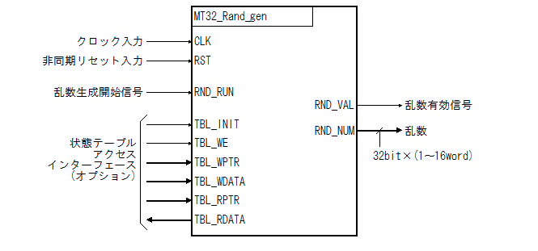

#Mersenne Twister Pseudo Random Number Generator


##Overview


###Introduction


このIPはMersenne Twister法による疑似乱数生成回路です。

こちらを参考に書いてみました。Mersenne Twister HomePage (http://www.math.sci.hiroshima-u.ac.jp/~m-mat/MT/mt.html)

mt19937arを元にしています。


###Features


* Mersenne Twister法による疑似乱数生成回路です。

* 状態テーブルの数(N)は624です。

* VHDLで記述しています。

* 論理合成可能です。Xilinx社のVivado、Altera社のQuartusIIで確認済み。

* １クロックで1、2、3、8、16ワード(1ワードは32bit)の乱数を生成します。

* ジェネリック変数でSEED値を設定できます。

* 状態テーブルを書き換えることが可能です。




Fig.1 Top-Level Signaling Interface

<br />


###Licensing


二条項BSDライセンス (2-clause BSD license) で公開しています。


##Specification


###Parameter Descriptions


Table.1 Parameter Descriptions

<table border="2">
  <tr>
    <td align="center">Name</td>
    <td align="center">TYPE</td>
    <td align="center">Default</td>
    <td align="center">Description</td>
  </tr>
  <tr>
    <td>L</td>
    <td align="center">Integer</td>
    <td align="center">1</td>
    <td>1クロックで生成する乱数の数を指定します。<br />このパラメータで指定できる数は、1、2、4、8、16のいずれかです。</td>
  </tr>
  <tr>
    <td>SEED</td>
    <td align="center">Integer</td>
    <td align="center">-</td>
    <td>乱数のシード値を指定します。</td>
  </tr>
</table>


###Port Descriptions


Table.2 Port  Descriptions

<table border="2">
  <tr>
    <td align="center">Name</td>
    <td align="center">Type</td>
    <td align="center">Width</td>
    <td align="center">I/O</td>
    <td align="center">Description</td>
  </tr>
  <tr>
    <td>CLK</td>
    <td align="center">STD_LOGIC</td>
    <td align="center">1</td>
    <td align="center">in</td>
    <td>クロック信号</td>
  </tr>
  <tr>
    <td>RST</td>
    <td align="center">STD_LOGIC</td>
    <td align="center">1</td>
    <td align="center">in</td>
    <td>非同期リセット信号<br />注)状態テーブルの内容はリセットしません</td>
  </tr>
  <tr>
    <td>RND_RUN</td>
    <td align="center">STD_LOGIC</td>
    <td align="center">1</td>
    <td align="center">in</td>
    <td>乱数生成開始信号<br />この信号が'1'になってから３クロック後に乱数を出力します<br />TBL_INITが'1'の時、この信号を'1'にしてはいけません</td>
  </tr>
  <tr>
    <td>RND_VAL</td>
    <td align="center">STD_LOGIC</td>
    <td align="center">1</td>
    <td align="center">out</td>
    <td>乱数有効信号<br />RND_NUMより生成された乱数が有効であることをしめす信号<br />RND_RUNが'1'になってから3クロック後に'1'になります</td>
  </tr>
  <tr>
    <td>RND_NUM</td>
    <td align="center">STD_LOGIC_VECTOR</td>
    <td align="center">32*L</td>
    <td align="center">out</td>
    <td>乱数出力信号<br />生成された乱数を出力する信号<br />RND_RUNが'1'になってから３クロック後に乱数を出力します</td>
  </tr>
  <tr>
    <td>TBL_INIT</td>
    <td align="center">STD_LOGIC</td>
    <td align="center">1</td>
    <td align="center">in</td>
    <td>状態テーブル・初期化信号<br />状態テーブルを初期化することを示します<br />この信号が'1'の時のみ、TBL_*信号は有効ですこの信号を'1'にすると、内部のカウンタがリセットされます</td>
  </tr>
  <tr>
    <td>TBL_WE</td>
    <td align="center">STD_LOGIC_VECTOR</td>
    <td align="center">1*L</td>
    <td align="center">in</td>
    <td>状態テーブル・ライト信号<br />状態テーブルへのライトを示す信号<br />ライトはワード(32bit)単位で行います</td>
  </tr>
  <tr>
    <td>TBL_WPTR</td>
    <td align="center">STD_LOGIC_VECTOR</td>
    <td align="center">16</td>
    <td align="center">in</td>
    <td>状態テーブル・ライトアドレス<br />状態テーブルへのライトアドレスをワード(32bit)単位で示します<br />例えば、LANE=2の場合下位1ビットは無視されます</td>
  </tr>
  <tr>
    <td>TBL_WDATA</td>
    <td align="center">STD_LOGIC_VECTOR</td>
    <td align="center">32*L</td>
    <td align="center">in</td>
    <td>状態テーブル・ライトデータ<br />状態テーブルへのライトデータをLSBで入力します</td>
  </tr>
  <tr>
    <td>TBL_RPTR</td>
    <td align="center">STD_LOGIC_VECTOR</td>
    <td align="center">16</td>
    <td align="center">in</td>
    <td>状態テーブル・リードアドレス<br />状態テーブルからのリードアドレスをワード(32bit)単位で示します<br />例えば、LANE=2の場合下位1ビットは無視されます</td>
  </tr>
  <tr>
    <td>TBL_RDATA</td>
    <td align="center">STD_LOGIC_VECTOR</td>
    <td align="center">32*L</td>
    <td align="center">out</td>
    <td>状態テーブル・リードデータ<br />状態テーブルからのリードデータ<br />TBL_RPTRの入力に対して１クロック後にTBL_RPTRで示したアドレスの値を出力します</td>
  </tr>
</table>


")

Fig.2 Generate Timing (L=1)

<br />


")

Fig.3 Generate Timing (L=4)

<br />


##Architecture


###Block Diagram


下図はL=1の時のブロック図です。


")

Fig.4 Block Diagram(L=1)

<br />


###RAMの構成(L=1の場合)


MT32_Rand_Gen は１クロックで１〜Lの乱数を生成します。ところがMersenne Twisterのアルゴリズムでは、１つの乱数を生成するためには次のように状態テーブル(mt)のi、(i+1) mod  N、(i+M) mod Nの位置の値が必要です。


```VHDL:mt19937ar.vhd
    procedure generate_word(
        variable generator  : inout PSEUDO_RANDOM_NUMBER_GENERATOR_TYPE;
        variable result     : out   RANDOM_NUMBER_TYPE
    ) is
        alias    mt         :       RANDOM_NUMBER_VECTOR(0 to generator.table'length-1) is generator.table;
        variable i          :       integer range mt'low to mt'high;
        variable x0,x1,xm   :       RANDOM_NUMBER_TYPE;
        variable y          :       RANDOM_NUMBER_TYPE;
        variable z          :       RANDOM_NUMBER_TYPE;
        constant mag01      :       RANDOM_NUMBER_VECTOR(0 to 1) := (0 => X"00000000", 1 => MATRIX_A);
    begin
        i  := generator.index;
        x0 := mt(i);
        x1 := mt((i+1) mod mt'length);
        xm := mt((i+M) mod mt'length);
        y  := (x0 and UPPER_MASK) or (x1 and LOWER_MASK);
        z  := xm xor (y srl 1) xor mag01(to_integer(y mod mag01'length));
        mt(i) := z;
        generator.index := (i+1) mod mt'length;
        y  := z;
        y  := y xor ((y srl 11));
        y  := y xor ((y sll  7) and X"9d2c5680");
        y  := y xor ((y sll 15) and X"efc60000");
        y  := y xor ((y srl 18));
        result := y;
    end procedure; 
```


1クロックで乱数を生成するには、状態テーブルから３つのアドレスのデータを同時に読み出す必要があります。通常ならライト１ポート、リード３ポートのRAMが必要ですが、基本的にiはインクリメントされるため、一つ前の乱数生成時に使用したMT[i+1]をレジスタに保存しておき、次の乱数生成時にMT[i]として使用すれば、ライト１ポート、リード２ポートのRAMで実装することが出来ます。MT32_Rand_Genでは、ライト１ポート、リード１ポートのRAMはライト１ポート、リード１ポートのRAMを二つ並べることで実装しています。


")

Fig.5 RAM Read and Twist Timing Chart (L=1)

<br />


####RAMの構成(L>1の場合)


MT32_Rand_GenではLに２、４、８、１６を指定することで、１クロックでそれぞれ2ワード、４ワード、８ワード、１６ワードの乱数を同時に生成することが出来ます。

そのためには、例えばL=4の場合、次の９箇所の状態テーブルの値を１クロックで読む必要があります。

1. i

2. (i+1) mod N

3. (i+2) mod N

4. (i+3) mod N

5. (i+4) mod N

6. (i+0+M) mod N

7. (i+1+M) mod N

8. (i+2+M) mod N

9. (i+3+M) mod N

MT32_Rand_genではRAMの構成を工夫することで、状態テーブルの値を同時に読んでいます。


まずは、MT[i]、MT[(i+1) mod N]、MT[(i+2) mod N]、MT[(i+3) mod N]、MT[(i+4) mod N]のRAMの構成を次図に示します。

L=1の場合と同様に、MT[(i+4) mod N] の値をレジスタに保持しておき、次のMT[i]として使用します。


-1")

Fig.6 Block Diagram(L=4)-1

<br />


次にMT[(i+0+M) mod N]、MT[(i+1+M) mod N]、MT[(i+2+M) mod N]、MT[(i+3+M) mod N]のRAM周りの構成を次図に示します。


-2")

Fig.7 Block Diagram(L=4)-2

<br />

注意点は、MT32_Rand_Gen ではM=397なので、例えばMT[i+0+M]はZ[i+1]を書き込んだRAMに格納されていることです。そのため、各RAMの出力は1だけローテーションして各Twistのxmに接続する必要があります。


####RAMのアドレス


RAMのアドレスのタイプは次のように定義しています。


```VHDL:mt32_rand_gen.vhd
    function  CALC_MT_PTR_LOW return integer is
        variable retval : integer;
    begin
        retval := 0;
        while (2**retval < L) loop
            retval := retval + 1;
        end loop;
        return retval;
    end function;
    function  CALC_MT_PTR_HIGH return integer is
        variable retval : integer;
    begin
        retval := 0;
        while (2**(retval+1) < N) loop
            retval := retval + 1;
        end loop;
        return retval;
    end function;
    constant  MT_PTR_LOW           : integer := CALC_MT_PTR_LOW;
    constant  MT_PTR_HIGH          : integer := CALC_MT_PTR_HIGH;
    subtype   MT_PTR_TYPE         is std_logic_vector(MT_PTR_HIGH downto MT_PTR_LOW);
```


また i mod Nなどいちいち剰余を計算するのは面倒なので、i は常にインクリメントされることを利用して、次のようにしています。


```VHDL:mt32_rand_gen.vhd
    function  TO_MT_PTR(arg:integer) return MT_PTR_TYPE is
        variable u : unsigned(MT_PTR_HIGH downto 0);
    begin
        u := to_unsigned(arg,u'length);
        return std_logic_vector(u(MT_PTR_TYPE'range));
    end function;
    function  INC_MT_PTR(ptr:MT_PTR_TYPE) return MT_PTR_TYPE is
        variable retval : MT_PTR_TYPE;
    begin
        if (unsigned(ptr) >= unsigned(TO_MT_PTR(N-1))) then
            retval := (others => '0');
        else
            retval := std_logic_vector(unsigned(ptr)+1);
        end if;
        return retval;
    end function;
```


さらに次のように各RAMへのアドレスを生成しています。

ここで各信号の意味は次の通り。

  * x_curr_index = ((i) mod N)/L

  * x_next_index = ((i+L) mod N)/L

  * m_curr_index = ((i+M) mod N)/L

  * m_next_index = ((i+L+M) mod N)/L


```VHDL:mt32_rand_gen.vhd
 CTRL: process(CLK,RST) begin
        if (RST = '1') then
                x_curr_index <= TO_MT_PTR(0);
                x_next_index <= TO_MT_PTR(0);
                m_curr_index <= TO_MT_PTR(M);
                m_next_index <= TO_MT_PTR(M);
                z_curr_index <= TO_MT_PTR(0);
                mt_read      <= '0';
                z_val        <= '0';
        elsif (CLK'event and CLK = '1') then
            if    (TBL_INIT='1') then
                x_curr_index <= TO_MT_PTR(0);
                x_next_index <= TO_MT_PTR(0);
                m_curr_index <= TO_MT_PTR(M);
                m_next_index <= TO_MT_PTR(M);
                z_curr_index <= TO_MT_PTR(0);
                mt_read      <= '0';
                z_val        <= '0';
            else
                if (RND_RUN = '1')then
                    x_curr_index <= x_next_index;
                    x_next_index <= INC_MT_PTR(x_next_index);
                    m_curr_index <= m_next_index;
                    m_next_index <= INC_MT_PTR(m_next_index);
                    mt_read      <= '1';
                else
                    mt_read      <= '0';
                end if;
                if (mt_read = '1') then
                    z_curr_index <= x_curr_index;
                    z_val        <= '1';
                else
                    z_val        <= '0';
                end if;
            end if;
        end if;
    end process;
```


##Simulation


###GHDLによるシミュレーション


####GHDLのバージョン


GHDLのバージョンは0.29です。

GHDLのホームページはこちら(http://ghdl.free.fr)


####Makefile


シミュレーション用に Makefile を用意しています。


```Makefile:Makefile
GHDL=ghdl
GHDLFLAGS=--mb-comments
WORK=work
TEST_BENCH = test_bench \\
             $(END_LIST)
all: $(TEST_BENCH)
clean:
	rm -f *.o *.cf $(TEST_BENCH)
test_bench: mt19937ar.o test_bench.o mt32_rand_gen.o mt32_rand_ram.o
	 $(GHDL) -e $(GHDLFLAGS) $@
	-$(GHDL) -r $(GHDLRUNFLAGS) $@
test_bench.o    :  ../../src/test/vhdl/test_bench.vhd mt32_rand_gen.o
	$(GHDL) -a $(GHDLFLAGS) --work=work $<
mt32_rand_gen.o :  ../../src/main/vhdl/mt32_rand_gen.vhd
	$(GHDL) -a $(GHDLFLAGS) --work=mt32_rand_gen $<
mt32_rand_ram.o:  ../../src/main/vhdl/mt32_rand_ram.vhd
	$(GHDL) -a $(GHDLFLAGS) --work=mt32_rand_gen $<
mt19937ar.o    :  ../../src/main/vhdl/mt19937ar.vhd
	$(GHDL) -a $(GHDLFLAGS) --work=mt32_rand_gen $<

```


####シミュレーションの実行


```Shell
$ cd sim/ghdl
$ cd make
ghdl -a --mb-comments --work=mt32_rand_gen ../../src/main/vhdl/mt19937ar.vhd
ghdl -a --mb-comments --work=mt32_rand_gen ../../src/main/vhdl/mt32_rand_gen.vhd
ghdl -a --mb-comments --work=work ../../src/test/vhdl/test_bench.vhd
ghdl -a --mb-comments --work=mt32_rand_gen ../../src/main/vhdl/mt32_rand_ram.vhd
ghdl -e --mb-comments test_bench
ghdl -r  test_bench
../../../src/ieee/numeric_std-body.v93:2098:7:@0ms:(assertion warning): NUMERIC_STD.TO_INTEGER: metavalue detected, returning 0
../../../src/ieee/numeric_std-body.v93:2098:7:@0ms:(assertion warning): NUMERIC_STD.TO_INTEGER: metavalue detected, returning 0
 check prgn_1.table
 1000 outputs of genrand_int32()
2991312382 3062119789 1228959102 1840268610  974319580 
2967327842 2367878886 3088727057 3090095699 2109339754 
1817228411 3350193721 4212350166 1764906721 2941321312 
	:
	(中略)
	:
../../src/test/vhdl/test_bench.vhd:297:9:@51680ns:(assertion failure):   Run complete...
./test_bench:error: assertion failed
./test_bench:error: simulation failed
ghdl: compilation error
```


最後にエラーが出てるように見えますが、これはassert(FALSE)でシミュレーションを終了しているためです。


###Vivadoによるシミュレーション


####Vivadoのバージョン


Vivado 2015.1


####Vivado プロジェクトの作成


すでにプロジェクトを作っている場合は省略してください。

プロジェクトを生成するためのTclスクリプトを用意しています。


sim/vivado/create_project.tcl


上記のTclスクリプトをVivado で実行するとプロジェクトが作成されます。


Vivado > Tools > Run Tcl Script > create_project.tcl


####シミュレーションを実行


Vivado > Open Project > mt32_rand_gen.xpr

Flow Navigator > Run Simulation > Run Behavioral Simulation


##Synthesis and Implementation


###Vivadoによる論理合成


####Vivadoのバージョン


Vivado 2015.1


####Vivado プロジェクトの作成


すでにプロジェクトを作っている場合は省略してください。

プロジェクトを生成するためのTclスクリプトを用意しています。


fpga/xilinx/vivado2015.1/mt32_rand_gen/create_project.tcl


上記のTclスクリプトをVivado で実行するとプロジェクトが作成されます。


Vivado > Tools > Run Tcl Script > create_project.tcl


デバイスはとりあえずxc7a15tcsg324-3を指定しますが、変更したい場合は、create_project.tcl を修正してください。


####Synthesis


Flow Navigator > Run Synthesis


####Implementation


Flow Navigator > Run Implementation


###QuartusIIによる論理合成


####QuartusIIのバージョン


QuartusII 13.1sp1


####QuartusII用のプロジェクト


fpga/altera/13.1sp1/mt32_rand_gen.qpf


##Acknowledgments


このような貴重なアルゴリズムを惜しげもなく公開してくださった方々にはひたすら感謝です。

